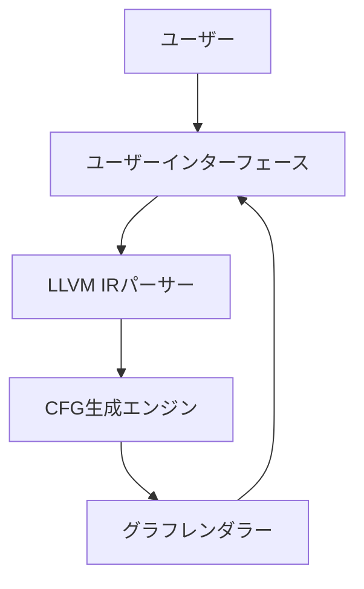
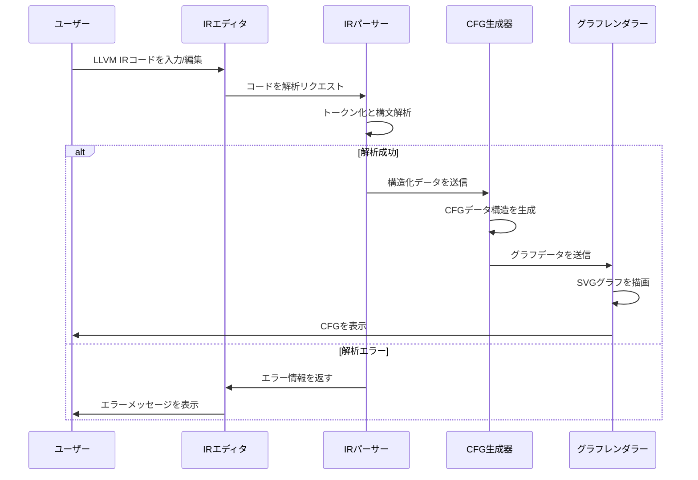

# System Patterns: LLVM IR to CFG Visualizer

## アーキテクチャ概要

このアプリケーションは、クライアントサイドのみで動作するシングルページアプリケーション（SPA）として設計されています。サーバーサイドの処理は行わず、すべての処理をブラウザ上で実行します。

## コアコンポーネント

### 1. ユーザーインターフェース（UI）レイヤー

- **レイアウトコンポーネント**: 画面を左右に分割し、左側にIRエディタ、右側にCFGビューアを配置
- **IRエディタコンポーネント**: LLVM IRコードの入力と編集を担当、シンタックスハイライト機能を提供
- **CFGビューアコンポーネント**: 生成されたCFGの表示と操作（ズーム、パンなど）を担当
- **コントロールパネル**: オプション設定や操作ボタンを提供（将来的な拡張）

### 2. LLVM IR解析レイヤー

- **トークナイザー**: LLVM IRコードをトークンに分解
- **パーサー**: トークンを解析して構造化データに変換
- **バリデーター**: IRコードの構文的・意味的な正当性を検証
- **エラーハンドラー**: 解析エラーを検出し、ユーザーに通知

### 3. CFG生成レイヤー

- **基本ブロック抽出器**: IRから基本ブロックを識別
- **エッジ検出器**: 基本ブロック間の制御フロー関係を特定
- **グラフ構造生成器**: ノードとエッジからグラフデータ構造を構築
- **レイアウトオプティマイザー**: グラフの視覚的な配置を最適化

### 4. レンダリングレイヤー

- **SVGレンダラー**: グラフをSVG形式で描画
- **スタイルマネージャー**: ノードとエッジの視覚的スタイルを管理
- **インタラクションハンドラー**: ユーザー操作（クリック、ドラッグなど）を処理
- **アニメーションコントローラー**: 遷移アニメーションを制御（将来的な拡張）

## データフロー

## 設計パターン

### 1. モジュールパターン
各機能を独立したモジュールとして実装し、明確なインターフェースを通じて通信します。これにより、コードの保守性と再利用性が向上します。

### 2. オブザーバーパターン
IRエディタの内容変更を監視し、変更があった場合に自動的にCFG生成とレンダリングプロセスをトリガーします。

### 3. ファクトリーパターン
グラフノードやエッジなどのオブジェクトを一貫した方法で生成するためのファクトリーを提供します。

### 4. ストラテジーパターン
レイアウトアルゴリズムやレンダリング方法を交換可能なストラテジーとして実装し、将来的な拡張を容易にします。

### 5. コマンドパターン
ユーザー操作（ズーム、パン、選択など）をコマンドオブジェクトとしてカプセル化し、操作の履歴管理や取り消し機能を可能にします（将来的な拡張）。

## 技術的な制約と対応策

### 1. パフォーマンス制約
大規模なIRコードの場合、解析とレンダリングに時間がかかる可能性があります。

**対応策**:
- 遅延評価とキャッシュを使用して不必要な再計算を避ける
- Web Workersを使用して解析処理をバックグラウンドで実行
- 大規模グラフの場合は段階的レンダリングを実装

### 2. ブラウザ互換性
異なるブラウザでの一貫した動作を確保する必要があります。

**対応策**:
- モダンなJavaScript機能のポリフィルを含める
- クロスブラウザテストを実施
- 機能検出を使用して代替実装を提供

### 3. メモリ使用量
複雑なグラフはメモリ使用量が多くなる可能性があります。

**対応策**:
- 効率的なデータ構造を使用
- 必要に応じてグラフの一部のみを詳細に表示
- メモリリークを防ぐための適切なリソース管理
